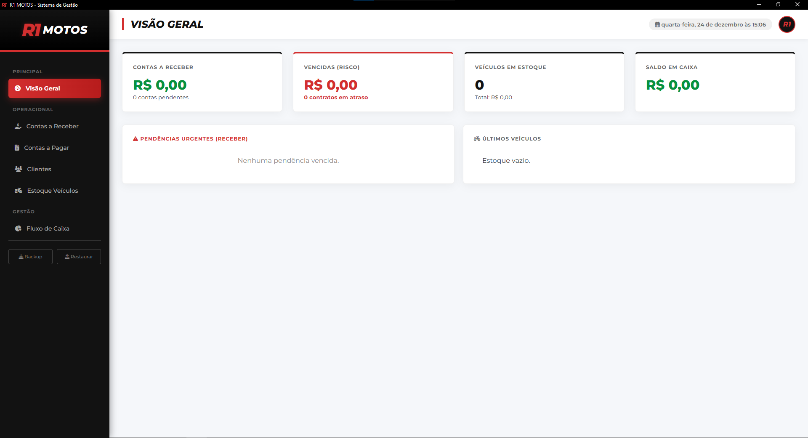

# Sistema de Gestão para Loja de Veículos

[](https://github.com/Guilherme-Bisof/Sistema-de-Gestao)
[](https://www.electronjs.org/)
[](https://developer.mozilla.org/pt-BR/docs/Web/JavaScript)

> Aplicação Desktop nativa (Windows) para gerenciamento completo de uma loja de veículos — focada em performance, operação offline e privacidade de dados.

---

## 📋 Sumário

- [Demonstração](#-demonstração)
- [Sobre o Projeto](#-sobre-o-projeto)
- [Funcionalidades](#-funcionalidades)
- [Tecnologias](#-tecnologias)
- [Estrutura do Projeto](#-estrutura-do-projeto)
- [Execução](#-execução)
- [Gerar Executável (.exe)](#-gerar-executável-exe)
- [Dados e Segurança](#-dados-e-segurança)
- [Autor](#-autor)

---

## 📸 Demonstração

<div align="center">
  
</div>

---

## 💻 Sobre o Projeto

Criado para a R1 Motos, este sistema substitui controles manuais e planilhas por uma solução local, sem mensalidades e com foco na privacidade do lojista. A interface foi desenvolvida com tecnologias web e empacotada com Electron para distribuição em Windows.

--

## ✨ Funcionalidades principais

- 🖥️ Aplicação Desktop nativa (instalável .exe) com ícone personalizado
- 💰 Gestão financeira: contas a pagar/receber, alertas de vencimento, cálculo de saldo
- 🏍️ Controle de estoque: cadastro de veículos com upload de múltiplas imagens (armazenadas em Base64)
- 👥 Gestão de clientes: histórico e contatos
- 🔒 Arquitetura Offline-First: armazenamento local (LocalStorage/JSON)
- 💾 Backup e restauração via exportação/importação em JSON

---

## 🛠️ Tecnologias

- HTML5, CSS3 (Grid, Flexbox, variáveis CSS)
- JavaScript (ES6+)
- Node.js
- Electron
- Electron Packager (para gerar o .exe)

---

## 📂 Estrutura do Projeto

```
Sistema de Gestao/
├── src/
│   ├── assets/      # ícones e imagens
│   ├── css/         # estilos (styles.css)
│   ├── js/          # lógica da aplicação (database.js, script.js)
│   └── index.html   # página principal
├── main.js          # processo principal do Electron
└── package.json     # dependências e scripts
```

---

## 🚀 Execução (Desenvolvimento)

**Pré-requisitos:** Git e Node.js instalados.

1. Clone o repositório

```bash
git clone https://github.com/Guilherme-Bisof/Sistema-de-Gestao.git
cd Sistema-de-Gestao
```

2. Instale as dependências

```bash
npm install
```

3. Execute em modo de desenvolvimento

```bash
npm start
```

---

## 🧰 Gerar Executável (.exe)

Para empacotar para Windows usando o Electron Packager:

```bash
# Instale o packager (opcionalmente global)
npm install -g electron-packager

# Ou use npx para empacotar
npx electron-packager . "Sistema de Gestao" --platform=win32 --arch=x64 --icon=src/assets/icon.ico --overwrite
```

> Ajuste os parâmetros conforme necessário (nome, platform, arch, icon).

---

## 🔒 Dados e Segurança

Este é um projeto Open Source com foco na lógica e estrutura da aplicação. Os dados são armazenados localmente (LocalStorage/JSON). Ao clonar o repositório, o banco de dados inicia vazio — não há dados reais de clientes neste repositório.

---

## 🤝 Contribuição

Contribuições são bem-vindas. Abra uma issue ou envie um pull request com melhorias, correções ou sugestões.

---

## 👨‍💻 Autor

Desenvolvido por Guilherme. Obrigado por ver o projeto — qualquer dúvida, abra uma issue no repositório.
