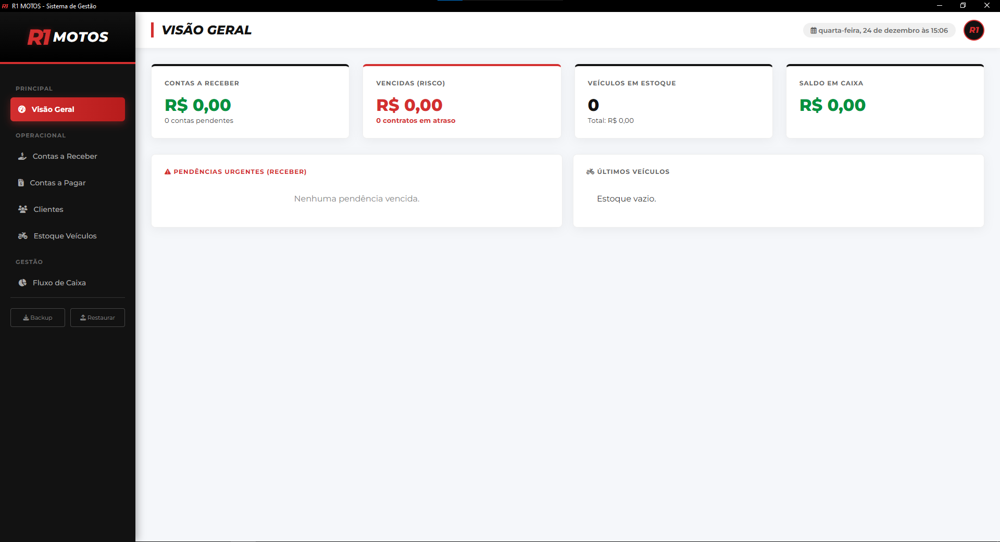

# Sistema de Gestão Comercial — R1 Motos

[](https://github.com/Guilherme-Bisof/Sistema-de-Gestao)
[](https://www.electronjs.org/)
[](https://developer.mozilla.org/pt-BR/docs/Web/JavaScript)
[](https://nodejs.org/)

> Solução robusta de software Desktop nativo (Windows) projetada para centralizar a operação, controle financeiro e gerenciamento de estoque de uma concessionária de veículos. Desenvolvida sob o conceito **Offline-First**, garante máxima performance, zero custo de infraestrutura de nuvem e total privacidade dos dados comerciais.

---

## 📋 Sumário

- [Demonstração](#-demonstração)
- [Sobre o Projeto](#-sobre-o-projeto)
- [Funcionalidades Principais](#-funcionalidades-principais)
- [Tecnologias e Arquitetura](#-tecnologias-e-arquitetura)
- [Estrutura do Projeto](#-estrutura-do-projeto)
- [O Que Este Projeto Demonstra Tecnicamente](#-o-que-este-projeto-demonstra-tecnicamente)
- [Como Executar a Aplicação](#-como-executar-a-aplicação)
- [Build e Empacotamento (.exe)](#-build-e-empacotamento-exe)
- [Segurança e Persistência](#-segurança-e-persistência)

---

## 📸 Demonstração

<div align="center">
  
</div>

---

##  Sobre o Projeto

A aplicação foi idealizada e desenvolvida para substituir processos manuais obsoletos e planilhas descentralizadas da loja **R1 Motos**. O desafio de negócio consistia em entregar uma interface moderna, ágil e que operasse 100% de forma local, eliminando custos com mensalidades de servidores e dependência de conexão com a internet para vender. 

O software encapsula a flexibilidade das tecnologias web modernas dentro do ecossistema **Electron**, fornecendo uma experiência desktop fluida, segura e de alto desempenho no sistema operacional Windows.

---

##  Funcionalidades Principais

* **Gestão Financeira Centralizada:** Módulo completo para fluxo de caixa (contas a pagar/receber), exibição de saldo dinâmico em tempo real e sistema automatizado de alertas para compromissos financeiros programados.
* **Controle Inteligente de Estoque:** Cadastro estruturado de veículos com upload e compressão de múltiplas imagens armazenadas de forma otimizada via strings Base64.
* **CRM / Gestão de Clientes:** Painel para armazenamento de contatos, dados cadastrais e histórico de interações comerciais.
* **Arquitetura Offline-First:** Mecanismo de persistência local que garante integridade absoluta dos dados mesmo sem conexão de rede.
* **Políticas de Backup:** Sistema nativo de exportação e importação da base de dados em formato JSON, mitigando o risco de perda de informações por falhas de hardware.

---

##  Tecnologias e Arquitetura

* **Runtime & Shell Desktop:** Node.js & Electron
* **Interface do Usuário (UI):** HTML5 Semântico & CSS3 Avançado (Grid System, Flexbox layouts e CSS Variables para manutenibilidade)
* **Lógica de Programação:** JavaScript Essencial (ES6+ assíncrono, manipulação de DOM e eventos)
* **Ferramentas de Distribuição:** Electron Packager (compilação e empacotamento nativo)

---

##  Estrutura do Projeto
```
Sistema de Gestao/
├── src/
│   ├── assets/      # Ativos estáticos (ícones e imagens de interface)
│   ├── css/         # Estilização global e variáveis arquiteturais (styles.css)
│   ├── js/          # Motores lógicos da aplicação (database.js, script.js)
│   └── index.html   # Camada de apresentação principal (View)
├── main.js          # Processo principal (Main Process) do Electron e ciclo de vida da app
└── package.json     # Gerenciamento de dependências, metadados e scripts de automação
```

---

##  Como Executar a Aplicação (Desenvolvimento)

**Pré-requisitos:** Certifique-se de ter o [Git](https://git-scm.com/) e o [Node.js (LTS)](https://nodejs.org/) instalados em sua máquina.

1. Instale o projeto localmente efetuando o clone do repositório:

```bash
git clone [https://github.com/Guilherme-Bisof/Sistema-de-Gestao.git](https://github.com/Guilherme-Bisof/Sistema-de-Gestao.git)
cd Sistema-de-Gestao
```

2. Instale todas as dependências de desenvolvimento necessárias:

```
npm install
```

3. Inicialize a aplicação em modo de desenvolvimento (hot-reload do Electron):

```
npm start
```

---

##  Build e Empacotamento (.exe)

Para gerar o instalador de produção otimizado para ambientes Windows (x64), execute o script de empacotamento:

```
# Execução direta via npx para compilação isolada
npx electron-packager . "Sistema de Gestao" --platform=win32 --arch=x64 --icon=src/assets/icon.ico --overwrite
```

> Ajuste os parâmetros conforme necessário (nome, platform, arch, icon).

---

## 🔒 Segurança e Privacidade de Dados

Este software opera sob a premissa de total soberania de dados do usuário. As informações financeiras e cadastrais permanecem restritas ao disco local do terminal onde o sistema está instalado. O repositório armazena estritamente a arquitetura lógica do sistema; as bases de dados iniciam completamente vazias e seguras para novas instalações comerciais.

---

## 🤝 Contribuição e Evoluções Futuras

Melhorias de arquitetura, refatorações e novas features são muito bem-vindas. Sinta-se à vontade para abrir uma Issue ou enviar um Pull Request.

Planos de evolução para o ecossistema do projeto:

[ ] Implementação de testes automatizados de interface.

[ ] Migração do motor de persistência local para SQLite.

[ ] Geração de relatórios gerenciais automatizados em PDF.

---

## 👨‍💻 Autor

Desenvolvido com foco em engenharia prática por Guilherme Bisof.

Conecte-se comigo no [Linkedin](https://www.linkedin.com/in/guilhermebisof/) para acompanhar outros projetos do meu portfólio.
